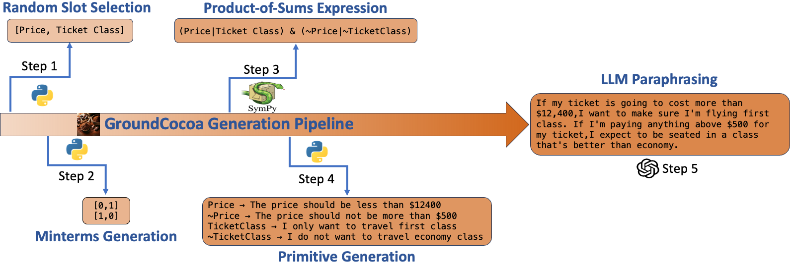

# GroundCocoa

This is the original implementation of the dataset generation as outlined in our paper -

Cleared for Takeoff? Compositional & Conditional Reasoning may be the Achilles Heel to (Flight-Booking) Language Agents

This paper is under review at the Conference on Language Modeling (COLM) 2024. The final dataset (both test and validation splits) are provided [here](flight_data/groundcocoa.json) and also can be downloaded from Huggingface! An overview of the query generation process is depicted in the figure below:

## Dependencies

Primary dependencies are included in the requirements.txt . To install, run - 

`pip install -r requirements.txt`

## How to Run (Step-by-Step)

The individual scripts correspond to various stages of the data creation pipeline as outlined in our paper. Paths corresponding to the intermediate files and other parameters are defined in [constants.py](constants.py). All of the following steps must be run in order.

### Flight Data Scraper

`python scrape_flight_data.py`

Source and target airports are randomly selected from the [list of busiest airports](flight_data/busiest_airports.csv) and scrapes flight data separately for each of the three classes - economy, business, and first class. The script requires that you have chromedriver corresponding to your google chrome version downloaded in the main directory of this project.

Parts of the code are adapted from the [flight-analysis](https://github.com/celebi-pkg/flight-analysis) project developed by Kaya Celebi. Due to Selenium's dependency on UI elements, small changes to the front-end might cause this code to fail and the element xpaths may have to be updated from time to time. 

### Product-of-Sums (POS) & Primitive Generation

`python requirements_generator.py`

This script randomly selects flight features and relies on [SymPy](https://www.sympy.org/en/index.html) to generate a POS Expression corresponding to a randomly generated minterms table.The various (slot, minterm) configurations are defined in [constants.py](constants.py) . Primitive constraints are then generated for each occurence of a slot within the POS expression.

### Paraphrasing using GPT-4 Turbo

`python llm_q_generator.py`

We use GPT-4 Turbo to rephrase our generated primitives and combine them to form the final user requirement. For this script to work, the 'OPENAI_API_KEY' must be set in your environment variables.

### Option Matching

`python construct_final_dataset.py`

Flight options corresponding to each route (scraped in the first step) are matched with the user requirement. Final dataset is created with 5 options (one matching and 4 not matching) for each user query.

## How to Run (Full Pipeline)

We also provide a method to run the entire pipeline, once the individual scripts are properly configured:

`python run_all.py`

## Citation